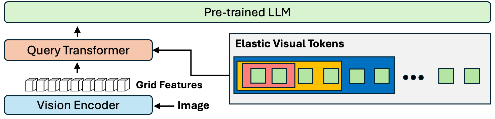

<div align="center">
  
# MQT-LLaVA: Matryoshka Query Transformer for Large Vision-Language Models

[Wenbo Hu](https://gordonhu608.github.io/), [Zi-Yi Dou](https://zdou0830.github.io/), [Liunian Harold Li](https://liunian-harold-li.github.io/), [Amita Kamath](https://amitakamath.github.io/), [Nanyun Peng](https://vnpeng.net/), and [Kai-Wei Chang ](http://web.cs.ucla.edu/~kwchang/)

<a href='https://arxiv.org/abs/2405.19315'></a> <a href='https://huggingface.co/gordonhu/MQT-LLaVA-7b'></a> <a href='https://huggingface.co/spaces/gordonhu/MQT-LLaVA'></a> <a href='https://gordonhu608.github.io/mqtllava/'></a> 

</div>

This repository hosts the code, data, and model weight of paper **MQT-LLaVA**, a vision-language model which allows for a flexible choice of the
number of visual tokens and accommodates varying computational constraints in different tasks. Visit our 📃 [paper](https://arxiv.org/abs/2405.19315) here!

## Overview
Our model employs a query transformer to encode images as visual tokens. We randomly
select the first m tokens during training, and enable flexible choice of any m number under M during
inference, where M is the maximum number of initialized tokens.
<p align="center">
  </a> <br>
</p>
Notably, our model matches LLaVA-1.5 performance across 11 benchmarks using half the number of its visual tokens. Moreover, reducing to 16 tokens (8x less TFLOPs)
only sacrifices the performance by 2.4 points on MMBench. On certain tasks
such as ScienceQA and MMMU, we can even go down to only 2 visual tokens
with performance drops of just 3% and 6% each. 
<p align="center">
  </a> <br>
</p>
<!-- <p align="center">
  </a> <br>
</p> -->

## Visuliaztion
We provide a Grad-CAM visualization of 1 randomly picked token from using 8, 16, 64, 256 visual
tokens, respectively, to encode an image. The model effectively concentrates on high-level concepts
using fewer tokens and delves into low-level details with more tokens.

<p align="center">
  </a> <br>
</p>

## Release 

- [5/29] 🔥 We released MQT-LLaVA. Checkout our code, [Demo](https://huggingface.co/spaces/gordonhu/MQT-LLaVA) and [model](https://huggingface.co/gordonhu/MQT-LLaVA-7b). 


## Installation and Setup
1. Clone this repository and navigate to MQT-LLaVA folder
```bash
git clone https://github.com/gordonhu608/MQT-LLaVA.git
cd MQT-LLaVA
```

2. Install Package
```bash
conda create -n mqt-llava python=3.10 -y
conda activate mqt-llava
pip install --upgrade pip  
pip install -e .
```

3. [Optional] Install additional packages for training cases
```bash
pip install -e ".[train]"
pip install flash-attn --no-build-isolation --no-cache-dir
```


## Quick Start, Inference with any number of visual tokens

<!-- <details>
<summary>Example Code</summary> -->

```Python
from llava.model.builder import load_pretrained_model
from llava.mm_utils import get_model_name_from_path
from llava.eval.run_llava import eval_model

model_path = "gordonhu/MQT-LLaVA-7b"
prompt = "What is unusual about this image?"
image_file = "assets/extreme_ironing.jpg"

args = type('Args', (), {
    "model_path": model_path,
    "model_base": None,
    "model_name": get_model_name_from_path(model_path),
    "query": prompt,
    "conv_mode": "llava_v1",
    "num_visual_tokens": 256,
    "image_file": image_file,
    "temperature": 0,
    "top_p": None,
    "num_beams": 1,
    "max_new_tokens": 512
})()

eval_model(args)
```
<!-- </details> -->
This code block can be used on Colab directly after downloading and installing this repository.


<details>
<summary>To load the model from Huggingface directly.</summary> 

```Python
from llava.model.builder import load_pretrained_model
from llava.mm_utils import get_model_name_from_path
from llava.eval.run_llava import eval_model

model_path = "gordonhu/MQT-LLaVA-7b"

tokenizer, model, image_processor, context_len = load_pretrained_model(
    model_path=model_path,
    model_base=None,
    model_name=get_model_name_from_path(model_path)
)
```
Check out the details wth the `load_pretrained_model` function in `llava/model/builder.py`.
</details>

## Pretraining Code
Please download the 558K subset of the LAION-CC-SBU dataset with BLIP captions we use in the paper [here](https://huggingface.co/datasets/liuhaotian/LLaVA-Pretrain).

Please refer to the documentation of llava1.5, set up the environment according to llava1.5's way, and organize the training data properly, placing it in the path ./playground. Then run the following code for inference:

```bash
bash scripts/v1_5/pretrain.sh
```

## Fine-tuning Code

Please download the annotation of the final mixture our instruction tuning data [llava_v1_5_mix665k.json](https://huggingface.co/datasets/liuhaotian/LLaVA-Instruct-150K/blob/main/llava_v1_5_mix665k.json), and download the images from constituting datasets:
- COCO: train2017
- GQA: images
- OCR-VQA: download script, we save all files as .jpg
- TextVQA: train_val_images
- VisualGenome: part1, part2

Download dataset images as in the finetuning process of llava1.5, place them in the playground, and then run the following code:
```bash
bash scripts/v1_5/finetune.sh
```

## Evaluation Code

When evaluating the model, we almost synchronously use the testing code of llava1.5, and the basic usage method is consistent. Please refer to [here](https://github.com/haotian-liu/LLaVA?tab=readme-ov-file#evaluation) for help. We provide the same script to complete the testing. When some of the evaluation dataset is also available in [VLMEvalKit](https://github.com/open-compass/VLMEvalKit), we use the evaluation code in VLMEvalKit instead. 

## Citation

If you find MQT-LLaVA useful for your research and applications, please cite using this BibTeX:
```bibtex
@misc{hu2024matryoshka,
      title={Matryoshka Query Transformer for Large Vision-Language Models}, 
      author={Wenbo Hu and Zi-Yi Dou and Liunian Harold Li and Amita Kamath and Nanyun Peng and Kai-Wei Chang},
      year={2024},
      eprint={2405.19315},
      archivePrefix={arXiv},
      primaryClass={cs.CV}
}
```

## Acknowledgement

- [Vicuna](https://github.com/lm-sys/FastChat): the codebase LLaVA built upon, and our base model Vicuna-7B that has the amazing language capabilities!
- [LLaVA](https://github.com/haotian-liu/LLaVA): the codebase we built upon.


## License
[](https://github.com/tatsu-lab/stanford_alpaca/blob/main/LICENSE)
**Usage and License Notices**: This project utilizes certain datasets and checkpoints that are subject to their respective original licenses. Users must comply with all terms and conditions of these original licenses, including but not limited to the [OpenAI Terms of Use](https://openai.com/policies/terms-of-use) for the dataset and the specific licenses for base language models for checkpoints trained using the dataset (e.g. [Llama community license](https://ai.meta.com/llama/license/) for LLaMA-2 and Vicuna-v1.5). This project does not impose any additional constraints beyond those stipulated in the original licenses. Furthermore, users are reminded to ensure that their use of the dataset and checkpoints is in compliance with all applicable laws and regulations.